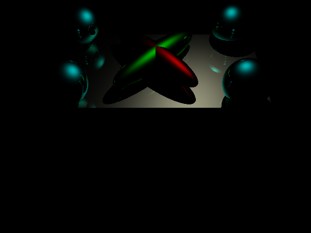

# Raytracer 3-D Modeling API

Model a scene in 3-dimensional space and render a view into an array of RGB
values. Supports point-source/directional lighting, reflections, diffusion,
etc. Written in C++.

A sample program demonstrating usage of the API is also provided.

**This project is currently being rebuilt from scratch.**

## Sample Output




## Get Started

#### Generating and using the core API
<br>

1. Run `make` in this project's root directory. This generates the file
`librt.a`, which is the static library for the raytracer algorithm.

2. Copy the following files into your project's file structure (location does
not matter):
  - rt.h
  - rt_shape.h
  - rt_triangle.h
  - rt_sphere.h
  - rt_scene.h
  - rt_raytracer.h
  - librt.a


3. Within your project, in whichever file you'd like to utilize the raytracer
library, add:
```c++
#include "rt.h"
```
Note that the other header files are not directly `#include`'d, as `rt.h`
already does that.

4. When compiling your source code, add the option `-I [path]` as the following:
```shell
g++ -I [path to dir containing header files] -c my_code.cpp
```

5. When building an executable, add the options `-L [path]` and `-l [library]`
as the following:
```shell
g++ -L [path to dir containing librt.a] my_code.o -l rt
```

#### Generating and running the sample program
<br>

1. Run `make raytracer` in this project's root directory. This generates the
file `raytracer`, which is the executable for the sample program.

2. Run `raytracer`, passing in the name of either the provided scene
configuration file or your own.

3. Wait until the raytracing completes. The console should print some minimal
feedback on the process.

4. An image file will be generated in the same directory as the executable.

## API

The core C++ API provides:
- Configuration of a scene, stored in a single object

- Configuration of a camera, stored in a single object

- Raytracing on a scene from the perspective of a camera

- Creation of an array of RGB tuples, essentially representing an image

Note:
- The API itself does not generate an image file of any sort. It simply
populates an array of the RGB tuples that make up an image, which the user can
filter/render as desired. To see how to render this output into an image file,
refer to the source code for the provided sample program
(`sample_program.cpp`). It is very straightforward, and it contains plenty of
comments.

- Parsing of the scene configuration file is also not part of the core API, but
an implementation is provided to supplement the sample program. If the provided
syntax for the scene configuration file is not desirable, the user may design
their own parser. As long as the core API's interfaces are dealt with correctly,
there should be no issues for the raytracer.

### Types and Functions

Although the user only needs to `#include "rt.h"`, the definitions are
distributed amongst various files so it may be daunting at first to learn the
interface. The locations of the definitions are as below. Take a peek inside
the header files for more details.

#### File `rt_shape.h`:
<br>

- `class RT_Shape` *(abstract)* - A generic shape in the scene to be rendered by
the raytracer. It holds attributes common to all types of shapes. This class
cannot be instantiated.

#### File `rt_triangle.h`:
<br>

- `class RT_Triangle` - A triangle in the scene. This is a subclass of
`RT_Shape`.

#### File `rt_sphere.h`:
<br>

- `class RT_Sphere` - A sphere in the scene. This is a subclass of `RT_Shape`.

#### File `rt_scene.h`:
<br>

- `class RT_Scene` - A scene to be rendered by the raytracer. This holds all the
various shapes with their configurations within the 3-dimensional space.

#### File `rt_raytracer.h`:
<br>

- `struct RT_RGB` - A tuple holding color values (red, green, blue) for a pixel.

- `struct RT_Ray` - A ray in 3-dimensional space, specified by a starting point
and a direction. Its primary purpose is to serve as the raytracing ray itself,
where the first collision between a shape in the scene and itself is registered
as the RGB value to use (with various other considerations, such as lighting
and reflection).

- `struct RT_Camera` - A camera in 3-dimensional space. Attributes consist of
location, direction, pixel width, pixel height, and horizontal and vertical
angles of view.

- `RT_RGB raytrace(const RT_Scene &scene, const RT_Ray &ray)` - Perform
raytracing on a scene with a single ray. This returns a single RGB tuple (what
the ray "sees").

- `std::vector<RT_RGB> raytrace(const RT_Scene &scene, const RT_Camera &camera)`
\- Perform raytracing on a scene with the specified camera configuration. This
deploys `width x height` rays, each of which generates an RGB tuple for the
corresponding pixel. These tuples are all returned in an array, sorted in
major-row fashion.

## Sample Program

The provided program, implemented in `sample_program.cpp`, is fairly simple to
understand. It does the following:

1. Using functions declared in `config_parse.h`, parse the sample scene
configuration file. This populates an instance of the class `RT_Scene`, which
holds all the information about the 3-dimensional space that is to be captured.
It also creates an instance of `RT_Camera`, which holds all the configuration
information on the view perspective.

2. Using functions declared in `rt_raytracer.h` (accessible via `rt.h`), run the
raytracer algorithm using both the `RT_Scene` and `RT_Camera` objects as input.
This generates an array of RGB tuples, where each pixel gets its own tuple.
This is the core part of the API and is by far the most computation-heavy.

3. Utilize the FreeImage library to generate and write to disk a .jpg image
file from the RGB array. This is done directly in the main function. The image
should be saved in the same directory as the sample program executable.

## Scene Configuration File

*Coming soon!*

## Multi-threading Support

*Coming soon!*

## External Resources

- [Wikipedia](https://en.wikipedia.org/wiki/LU_decomposition#C_code_examples
"C code examples for LU decomposition") - Code for matrix LU decomposition
- [FreeImage](http://freeimage.sourceforge.net/ "FreeImage Homepage") - Library
for translating RGB data into image files
